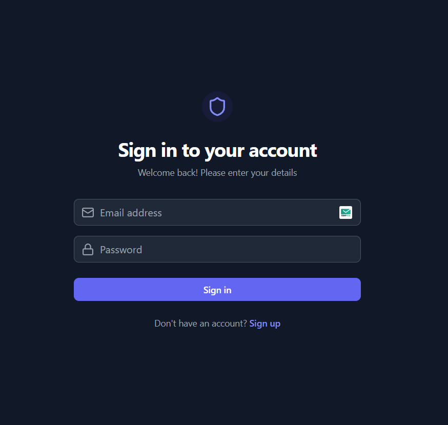
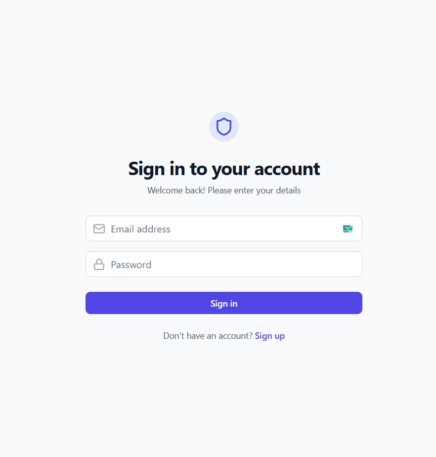
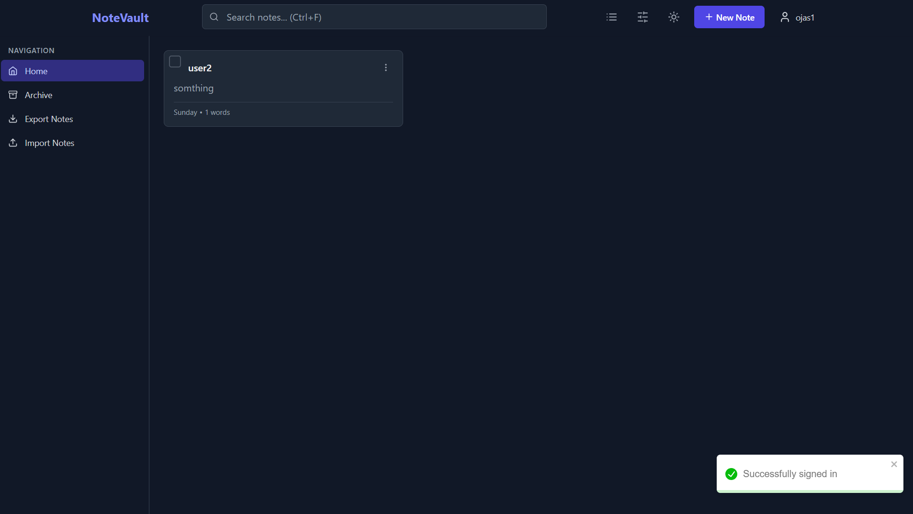
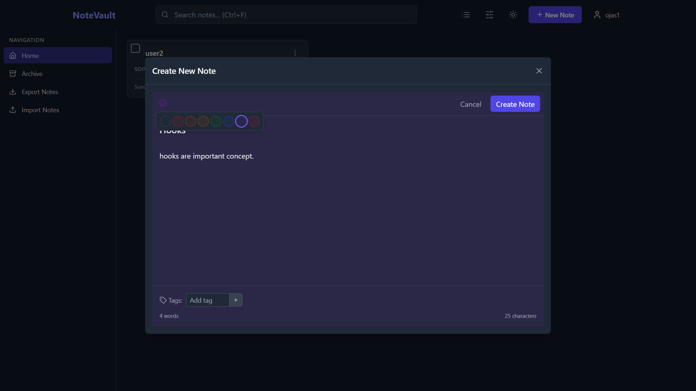
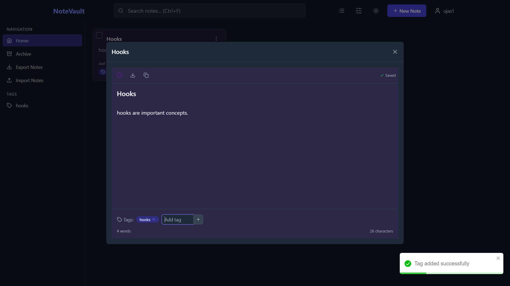
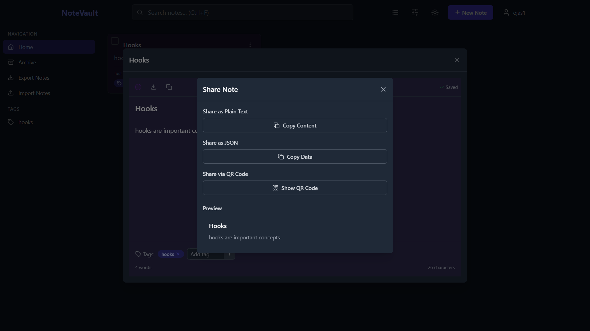
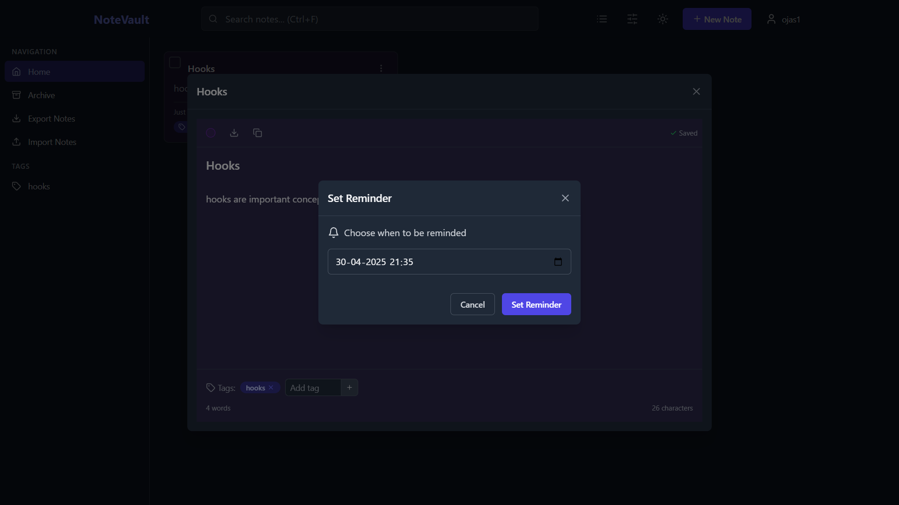

# NoltVault 📝

A powerful, minimalist, and responsive note-taking application built with **React + Vite + TypeScript**, styled using **Tailwind CSS**, backed by **Supabase**, and deployed on **Netlify**.

[](https://app.netlify.com/sites/ojas-notevault/deploys)

🔗 **Live Demo**: [ojas-notevault.netlify.app](https://ojas-notevault.netlify.app)

---

## ✨ Features

- ✅ **Full CRUD operations** for notes
- ⏰ **Reminder system** for notes
- 🔍 **Search** and 🔃 **Sort** functionality
- 🏷️ **Tagging system** for note categorization
- 📌 **Pin / Unpin** and 🗃️ **Archive / Unarchive** notes
- ⬆️⬇️ **Import / Export** notes
- 📤 **Share notes** via public link or **QR code**
- 🌗 **Dark / Light theme toggle**
- 🔄 **Real-time auto-saving** while editing notes
- 📦 **Batch operations** (select multiple notes)
- 📱 **Responsive** UI for all devices
- 🔔 Toast notifications via **react-toastify**
- 🧼 **Minimalist UI/UX** for distraction-free writing

---

## 🚀 Tech Stack

- **React + Vite** – Frontend framework
- **TypeScript** – Type safety
- **Tailwind CSS** – Utility-first styling
- **Supabase** – Backend-as-a-Service (Auth, DB, Storage)
- **Netlify** – Deployment & hosting
- **React Toastify** – Notifications

---

## 📸 Screenshots

### 🔐 Login Page



---

### 🏠 Home / Dashboard



---
### ✏️ Note



---

### ✏️ Note Editor



---

### ✏️ Share Editor



---

### ✏️ Reminder Editor



---

## 📦 Getting Started

### 1. Clone the repository

```bash
git clone https://github.com/your-username/noltvault.git
cd noltvault